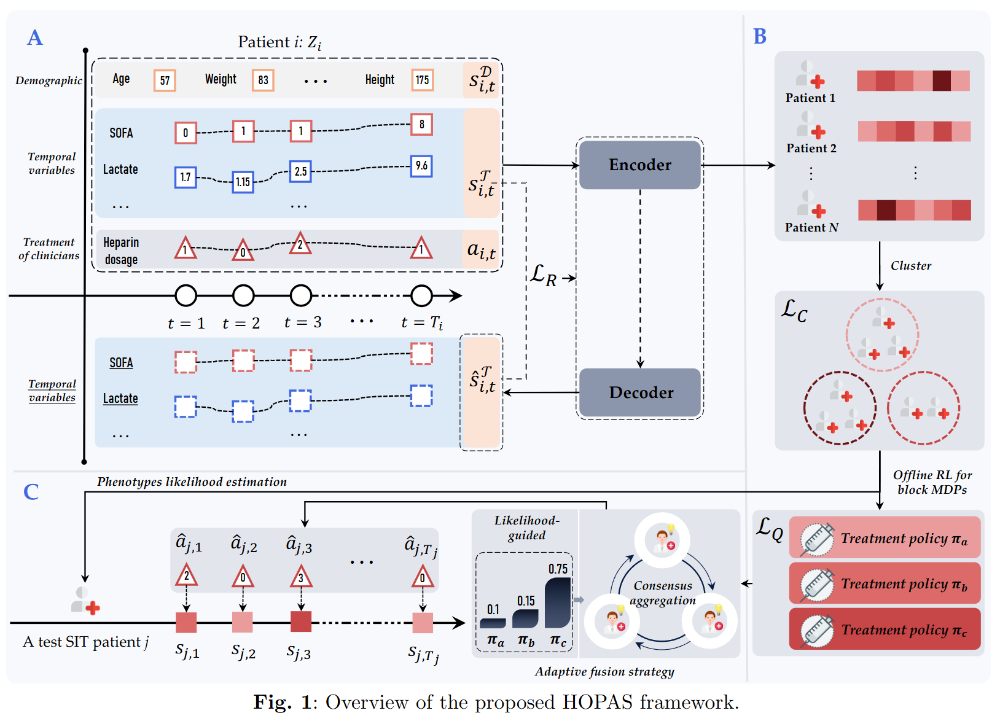

# Heterogeneous Policy Dynamic Fusion with Offline Reinforcement Learning for Sepsis-induced Thrombocytopenia Treatment Recommendation
### Hongwei He(1), Yun Li(2,3), Yuan Cao(2,3), Mucan Liu(1,4), Chonghui Guo(1), Hongjun Kang(3)
#### 1 Institute of Systems Engineering, Dalian University of Technology, Dalian, 116024, China.
#### 2 Medical School of Chinese PLA, Beijing, 100853, China.
#### 3 Department of Critical Care Medicine, Chinese PLA General Hospital, Beijing, 100853, China.
#### 4 Department of Information Systems, City University of Hong Kong, Hong Kong, China.
### 2025.04.07

